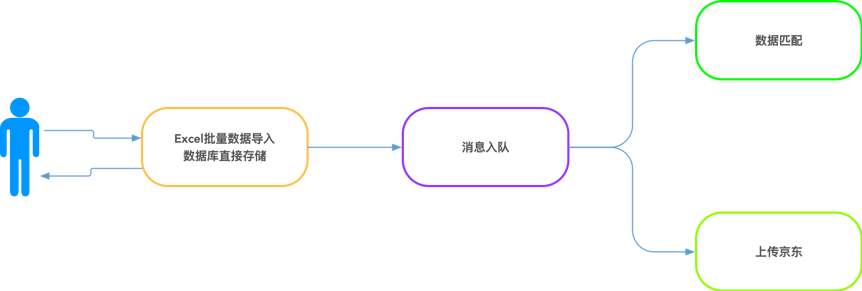
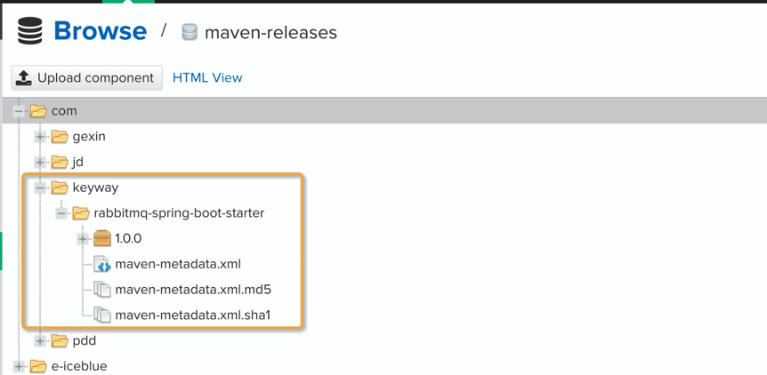
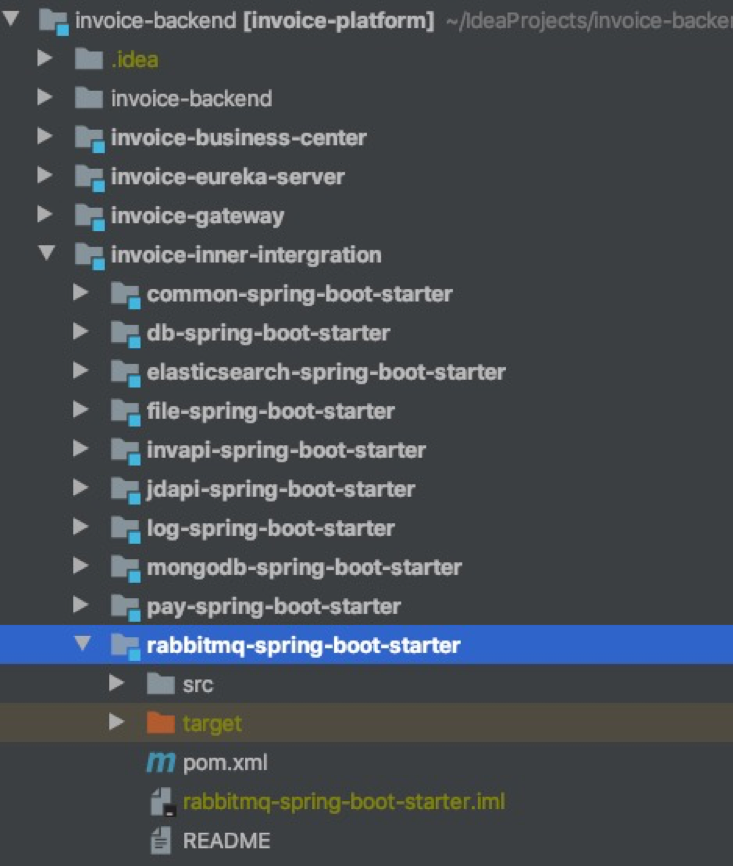

## 1 简介
### 1.1 由来
   RabbitMQ是一个由Erlang语言开发的AMQP的开源实现。最初起源于金融系统，用于在分布式系统中存储转发消息，在易用性、扩展性、高可用性等方面表现不俗。Springboot工程中，运用rabbitmq时，一般有两种方式：  
1) 声明式这种方式使用居多，即在代码中单独声明队列、交换机以及路由键绑定。  
   优势：因队列等是项目启动时创建好的，消费端支持使用@RabbitListener注解监听队列消息，实现简单。  
   缺点：在队列较多的情况下，需要编写较多的声明代码，且不支持动态创建。  
2) 动态创建此种方式一般依赖于amqpAdmin动态创建队列、交换机以及路由键绑定。  
   缺点：因代码启动时，队列、交换机及路由键绑定尚未创建，因此无法采用@RabbitListener注解进行消息消费，需要手动实现循环拉取消息的方式。  
   优点：无须提前声明队列，支持动态创建。  
### 1.2 构件特点
   种方式进行了整合和封装，主要有以下特点：  
1) 无须提前声明队列、交换机以及路由键绑定，支持动态创建，一行代码发送消息。  
2) 支持注解式消息消费，不依赖于队列、交换机等的提前声明，使用方式更加简化。  
3) 优化了消息生产者端重试机制，支持配置开启重试或禁用，消息投递的可靠性更高。       
4) Springboot项目引入starter组件maven坐标即可使用，学习成本几乎为零。  
## 2 应用场景
### 2.1 异步处理
   场景：用户通过excel一次性上传5000条信息，每一条都需要调用一个较长的业务链进行匹配验证处理。  
   作用：引入消息队列后，把长业务逻辑进行异步处理，再利进行消息推送结果至前端页面，可避免用户等待，甚至等待超时，在消费端还支持水平扩展，理论上在消费端资源有保障的情况下，队列容量没有上限。  
   由此可以看出,引入消息队列后，用户的响应时间就等于写入数据库的时间+写入消息队列的时间(可以忽略不计)。


###  2.2 应用解耦
   场景：接上一节，数据匹配后，需要上传京东，在数据量较大时，由于京东平台流控，我们的请求可能出现失败的情况。  
   作用：引入消息队列后，用户发起数据匹配请求,匹配模块完成匹配后数据进行持久化处理,同时将消息写入消息队列,返回用户匹配成功；上传模块订阅消息,获取消息,进行上传操作，就算上传被流控，出现故障，消息队列也能保证消息的可靠投递，自动进行重试，不会导致消息丢失。
###  2.3 限流削锋
   场景:流量削峰一般在秒杀活动中应用广泛，一般会因为流量过大，导致应用挂掉，为了解决这个问题，一般在应用前端加入消息队列。  
   作用: 可以控制活动人数，超过此一定阀值的订单直接丢弃，可以缓解短时间的高流量压垮应用。即服务器收到用户的请求后，首先写入消息队列，加入消息队列长度超过最大值，则直接抛弃用户请求或跳转到错误页面，秒杀业务根据消息队列中的请求信息，再做后续处理。
   
   
###   2.4 日志处理
  场景：在某些场景下，尤其是数据处理类的功能模块，需要对业务日志进行埋点，记录方法的入参和出参，方便后续对处理结果进行验证。此种场景下，数据需要大量写入数据库，对数据库造成的压力较大。  
  作用：借助队列，可以实现数据写入缓冲。
###   2.5 消息通讯
  场景:消息队列广泛运用在跨组件通信业务中，如管理平台与各类算法模块的调度、亦如2.1节所述异步处理结果推送、消息广播等。  
  作用：实现跨平台组件、跨语言通信。
##   3 快速入门
###   3.1 安装
  1) 在maven私服上传easy-rabbitmq-starter-1.0.0.jar：  
  
  
或在工程内部直接引用源码（发票管家和ERP均是这种引用方式）：  
   
   
2) 在项目的pom.xml的dependencies中加入以下内容:  
```xml
<dependency>
      <groupId>com.keyway</groupId>
      <artifactId>easy-rabbitmq-starter</artifactId>
      <version>1.0.0</version>
</dependency>
```
### 3.2使用
此处以topic为例，demo中以direct为例。  
    1) 在application.yml增加配置如下：
```yml
spring:
  rabbitmq:
    host: ${inv-cloud-service}
    port: 5672
    username: admin
    password: admin
    virtual-host: lcq-test
    enable: true #是否开启发送端重试
    publisher-confirms: true #是否使用快速构建，false则需要使用原生listener
inv-cloud-service: 192.168.13.107
```
2) 消息发送端：  
注入生产者类：
```java
@Autowired
private EasyBuildRabbitMqProducer easyBuildRabbitMqProduce
```
一行代码发送消息：  
```java
saeyBuildRabbitMqProducer
.buildTopicMessageSender(EXCHANGE, QUEUE)//交换机、队列
.send("xxx");//发送消息内容
```
3) 消息消费端：  
```java
@EasyRabbitListener(exchange = EXCHANGE,//交换机
routingKey = INVOICE_UPLOAD_TOJD_ROUTING_KEY, //路由键
queue = QUEUE_NAME,//队列名
type = "topic"//类型)
public void foo(Message message){//消费业务逻辑}
```
## 4 其他特性
### 4.1 事务型消息发送器TransactionSendUtil

1) TransactionSendUtil支持消息发送分步操作，可对消息的发送及业务流程实现mq事务控制，目前仅支持使用最多的topic模式：  
 ```java
TransactionSendUtil sender = TransactionSendUtil
.init(connectionFactory)//初始化
.routingKey(key)//路由键
.exchange(exchange);//交换机
```

2) 根据消息是object还是list，可以选择处理模式，如果是list则选择多消息模式：  
    
```java
sender.multi();//开启多条处理
sender.sendMessage(xxx);//发送内容
```
3) 在业务执行完成后，提交执行发送：  
```java
sender.exec();//确认事务
```
完整流程如下：
```java
TransactionSendUtil sender = TransactionSendUtil.init(connectionFactory).routingKey(key).exchange(exchange);
try{
    sender.multi();
    sender.sendMessage(xxx);
    sender.exec();
}catch(IOException e){
//异常处理
}
```
### 4.2 并发线程消费快速构件消费者，可以支持多线程并发消费，仅需简单配置即可：
```java
@EasyRabbitListener(exchange = INVOICE_UPLOAD_BATCH_EXCHANGE,
routingKey = INVOICE_UPLOAD_TOJD_ROUTING_KEY,
queue = INVOICE_UPLOAD_TOJD_QUEUE_NAME,
type = "topic",
concurrency = "10")
```
目前最多支持20个线程并发。

### 4.3 发送端重试
开启发送者确认模式开启后，如果消息没有到exchange,则confirm回调,ack=false,此时通过retryCathe重试（默认一分钟一次，三次后放弃发送）:
    
```yml
publisher-confirms: true #开启发送端重试
```
## 5 待完善
### 5.1 基于注解的消息发送
已实现尚未整合。
### 5.2 广播模式支持
目前暂不支持广播模式，后期可进行扩展。
